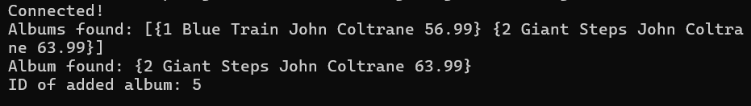

# Data Access GORM: Accessing a relational database

By: Yehezkiel Wiradhika <br />
NRP: 5025201086 <br />
Class: PBKK D

## About

- Create a folder for your code.
- Set up a database.
- Import the database driver.
- Get a database handle and connect.
- Query for multiple rows.
- Query for a single row.
- Add data.

## Compilation

To Compile and run use the following commands

```
$ sh create-tables.sh
```

note: <br />
fill DBUSER and DBPASS first in `create-tables.sh`

here's the result:



## References

From the tutorial: https://go.dev/doc/tutorial/database-access
